# 概述


## 运行机制
1. java源文件.java 源文件的基本组成部分是类class
2. 程序执行入口：`public static void main(String[] args)`，程序入口可以在非public类中，可以有多个
3. 区分大小写
4. 一个源文件嘴都只能有一个public类，文件名称必须和public类名同名
5. 文档注释：javadoc -d 目标位置 -author -version 源文件名

## java doc
1. jdk包含package，package包含class、interface、异常，class包含字段、构造器、成员方法
2. 中文在线文档：[https://www.matools.com/api](https://www.matools.com/api)
3. 官方在线文档：[https://docs.oracle.com/en/java/javase/21/docs/api](https://docs.oracle.com/en/java/javase/21/docs/api)


# 变量


## data type
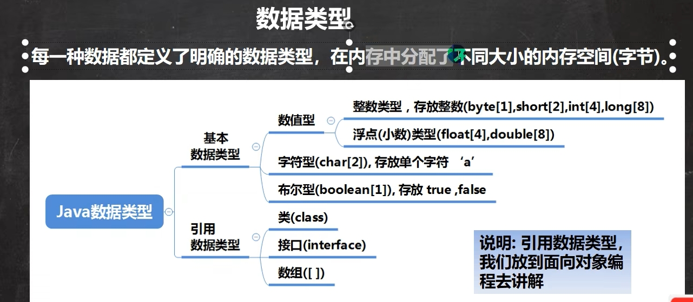

1. 基本数据类型 + 引用数据类型
2. 浮点数 = 符号位 + 指数位 + 尾数位（尾数部分可能丢失）
3. float型后面必须加f或F，double不需要；
4. 2.7和8.1/3不相等（有精度的问题）
5. boolean:只有**false**和**true**，不能等效0或1
7. 字符串转int：包装类 `String str = "123"; int num = Integer.parseInt(str);`

## 编码和char
1. ASCII：一个字节，只用了后面7位，最前面为0，可以表示256个字符，只用了128个
2. utf-8：大小可变，字母1字节，汉字3字节
3. Unicode：字母和汉字都是两个字节，兼用ASCII码
4. gbk：字母1字节，汉字2字节


## 自动类型转换
1. 精度小-->精度大：
    * char[1] int[4] long[8] float[4] double[8]
    * byte[1] short[2] int long float double
2. (char, short) 和char之间不会互相转换
    * byte b = 10; 对
    * char c = b; 不对
3. byte、short、char三者可以计算，自动转换成int（相同类型相加也会自动转换）

## 强制类型转换
`(int) 1.9`
1. char可以保存int常量值，不能保存变量值
    * char c = 100; // ok
    * int m = 100; char = m; // error
2. 复合运算符包含强制类型转换：
    `byte b = 2;
    b += 3;// b = (byte)(b + 3);`

## 命名规范
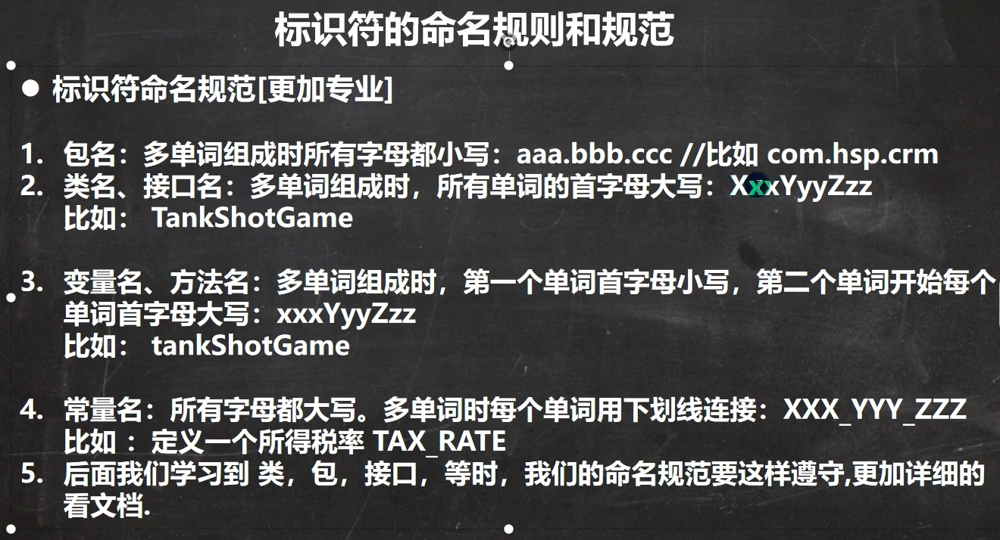

## 进制
1. 二进制：0b
2. 十进制：没有前缀
3. 八进制：0
4. 十六进制：0x或0X
5. Java没有无符号数
6. 位移运算：
    * 算术右移>>：低位溢出，高位补符号位
    * 算术左移<<：高位溢出，低位补0
    * 逻辑右移>>>：低位溢出，高位补0

## 运算
1. 自增运算：
    * `int i = 1; i = i++;` 结果为1，过程：temp = i; i = i + 1; i = temp;
    * `int i = 1; i = i++;` 结果为2，过程：i = i + 1; temp = i; i = temp;

## switch
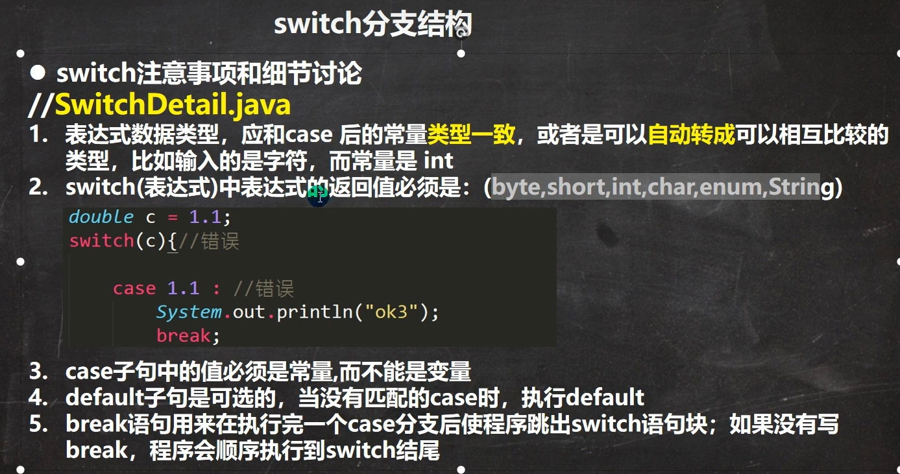


# 数组


## 数组内存细节
1. String[] names = {"ABC", "DEF", "abc"};
    names[0] 实际上指向的是字符串的地址
2. 二维数组的每一列的大小可以不同；


# 面向对象OOP


## 类
**五大成员：属性 方法 构造器 代码块 内部类**
1. 类的属性（成员变量、field、字段）：基本数据类型存放在**堆**，引用数据类型存放在**方法区**中的**常量池**
2. 访问修饰符：`public protected 默认 private`
3. 内存分配机制：
    * 栈：一般存放基本数据类型（局部变量）
    * 堆：存放对象
    * 方法区：常量池（常量，如字符串），类加载信息
4. 内存调用机制:
    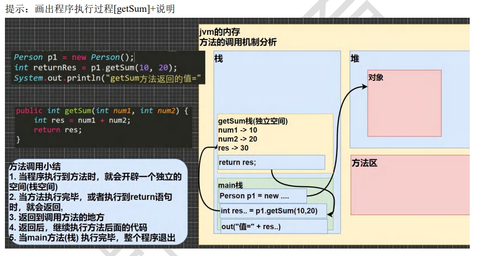
5. 方法

## overload 重载（同一个类中）
1. 方法名必须相同
2. 形参（类型、顺序、数量必须不能完全一样）
3. 返回值类型无影响

## 可变参数(int... num)
1. 本质是数组，可以用num.length
2. 一个形参列表只能用一个可变参数，放在最后
3. 可变参数的实参可以为0个或多个，也可以为数组

## 作用域
1. 主要变量：成员变量（属性） + 局部变量
2. 成员变量为全局变量，可以不赋值，有默认值，可以加修饰符
3. 局部变量必须先赋值，再使用，不能加修饰符

## 构造器(constuctor)
1. cpp构造函数，没有返回值，可以重载
2. 自定构造器后，默认的无参构造器没有了

## 对象创建流程
1. 加载Person.class信息，只加载一次
2. 在堆中分配空间
3. 完成对象初始化：
    * 默认初始化：`age = 0 name = null`
    * 显示初始化：
    * 构造器初始化
4. 堆中的地址，返回给对象名称p

## this super
1. this 关键字可以用来访问本类的属性、方法、构造器
2. this 用于区分当前类的属性和局部变量
3. 访问成员方法的语法: this.方法名(参数列表)
4. 在类的构造器中访问构造器：`this(参数列表)`，只能在构造器访问构造器使用，必须放在第一行
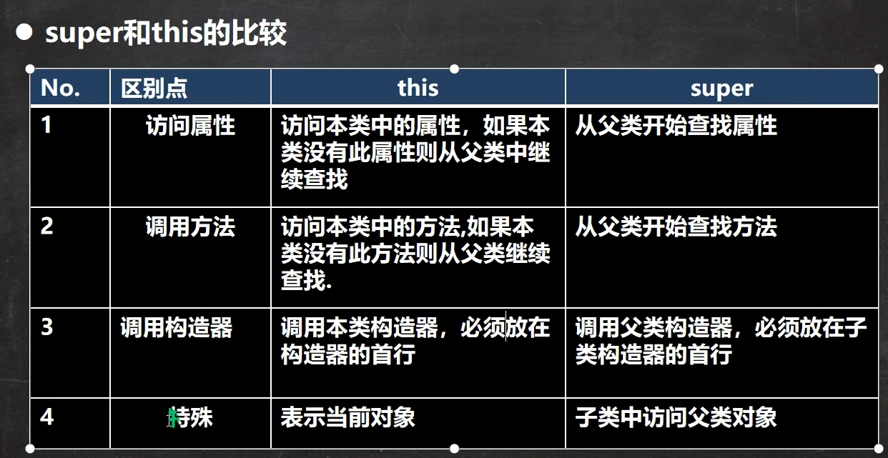

## 包package
`package + 包名`，使用是放在最上面，声明当前所在的包
1. 区分相同名字的类
2. 控制范围
3. 本质就是创建文件夹存储类

## 访问修饰符
1. 只有默认和public能修饰类
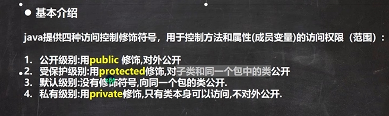
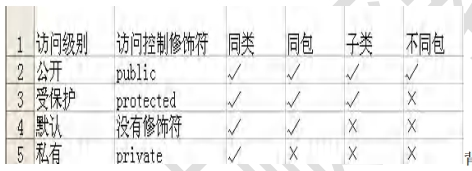


## 封装encapsulation
1. 实现步骤：
    * 将属性私有化（private）
    * 提供public的 get和set方法

## 继承extends
1. 提高代码复用性
2. 私有属性和方法不能在子类直接访问，要通过父类提供公共方法去访问
3. 子类必须调用父类的构造器，完成父类的初始化
4. 子类调用父类构造器：
    * super() 必须放在构造器第一行, super() 和 this不能共存在同一个构造器中
    * 可以在子类的构造器中显示调用`super(参数列表);`
    * 隐式调用可以不写，或者写`super();`会调用父类的无参构造器
5. Java是单继承

## Override 重写
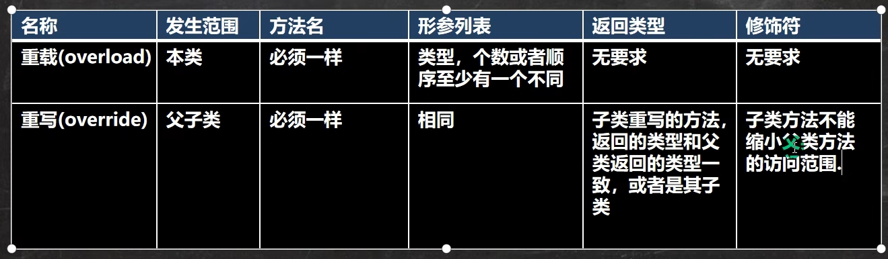

1. 子类方法的参数、方法名称 和 父类完全一致
2. 子类的返回类型和父类相同，或者子类的返回类型是父类返回类型的子类
3. 子类方法不能缩小父类方法的访问权限: public > protected > 默认> private


## 多态polymorphic
1. 方法的重载和重写体现多态
2. 对象的多态：
    * `Animal animal = new Dog();`左边是编译类型，不能改变，右边是运行类型，可以改变
    * `animal = new Cat();`运行类型变为Cat;
3. 向上转型：父类的引用指向了子类`Animal animal = new Dog();`
    * animal可以调用父类的所有成员（遵守权限），不能调用子类的特有成员（在编译阶段就确定了）
    * 调用方法时，和重写一样，先看子类，再一层层往上
    * 方法的调用看运行类型，熟悉的调用看编译类型
4. 向下转型：`子类类型 子类引用 = (子类类型) 父类引用`
    * `Cat cat = (Cat) animal;`
    * 只能强转父类引用，不能强转父类对象
    * 当前父类引用必须是指向目标子类类型的对象
    * 可以调用子类类型的所有成员
5. 属性的值看编译类型，编译类型中属性值为多少，输出就是多少
6. `变量 instanceof 类` 判断变量（或者对象）的运行类型是否是后面的类
    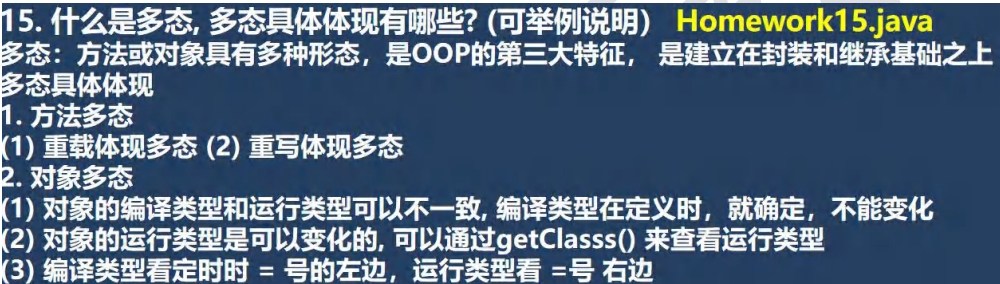

## 动态绑定
1. java的动态绑定机制当调用对象方法的时候，该方法会和该对象的内存地址/运行类型绑定
2. 当调用对象属性时，没有动态绑定机制，哪里声明，哪里使用

## equals ==
1. equals只能判断引用类型
2. ==：
    * 可以判断引用类型，是否为同一个对象，即地址是否相同
    * 可以判断基本类型，值是否相同


# 面向对象高级(OOP_Advanced)

## 类变量(静态变量)
1. static变量对同一个类的所有对象共享
2. 静态变量在类加载时就生成了
3. 静态变量可以直接通过类名调用，也可以通过对象名调用
    * `Class.count;`
    * `new Class().count;`

## 类方法（静态方法）
1. 静态方法可以直接通过类名调用，不用再新建对象
2. 常用的工具类可以设置为静态方法
3. 当方法不涉及任何和对象相关的成员，可以设置为静态方法
4. **静态方法只能访问静态成员、非静态方法可以访问静态成员**
5. 静态方法不能使用this super


## main方法
`public static void main(String[] args)`
1. JVM调用main方法，main的访问修饰符必须是public
2. JVM调用main方法的时候不需要创建对象，因此必须是static
3. java hello 参数1 参数2 参数3... 参数打包成字符串数组args，传给main方法
4. 不能直接访问该类中的非静态成员，必须创建该类的一个实例对象后，才能通过这个对象去访问类中的非静态成员
5. 在 main()方法中，我们可以直接调用 main 方法所在类的静态成员

## 代码块
`[修饰符]{代码}`
1. 构造器会默认**先调用代码块**
2. 修饰符可选，只能选static或者不写
    * 静态代码块只执行一次，在类加载的时候执行
    * 非静态代码块创建对象时调用，每创建一个对象都调用一次
    * 加载不是创建对象，加载时会**先执行静态代码块**，创建执行普通代码块（默认先执行super，在执行普通本类的普通代码块）
    * 使用类的静态成员时，普通代码块不会被执行
    * 静态代码块只能调用静态成员，普通代码块可以调用所有成员
3. 类的加载时间
    * 创建对象实例时(new)
    * 创建子类对象实例，父类会被加载
    * 使用类的静态成员时
4. 多个静态代码块，按定义顺序执行

## 单例模式
1. 饿汉式
    * 步骤：
        1) 将构造器私有化
        2) 在类的内部直接创建static对象
        3) 提供一个公共的static方法，返回该对象
    * 在类加载时就创建对象实例(static)
    * 存在资源浪费的可能
2. 懒汉式
    * 在使用时才创建实例，会存在线程安全(同时多个线程调用getInstance())

## final
1. 当本类不希望被继承时，可以添加final
2. 当本类的方法不希望被重写时，可以添加final
3. 当本类的属性不希望被修改时，可以添加final
4. 不希望局部变量被修改，可以添加final
5. final修饰的变量又称常量，大写
    * 定义时赋值
    * 或在构造器中赋值
    * 或在代码块中赋值
    * 若final修饰的是static变量，则只能在定义或者静态代码块中赋值，不能在构造器中赋值
6. final不能修饰构造器
7. final和static搭配使用，不会导致类的加载
8. 包装类(Integer, Double,Float,String等)final类，不能被继承

## 抽象类abstract
1. 抽象类不能别实例化，抽象类不一定包含抽象方法，可以包含实现方法
2. 包含抽象方法的类一定是抽象类
3. abstract不能修饰属性，只能修饰类和方法
4. 如果一个类继承了抽象类，则必须实现抽象类的所有抽象方法，或者自己声明为抽象类
5. 抽象方法不能使用private、final、static

## 接口interface
1. 接口里都是抽象（可以省略abstract）方法，或者default方法，或者静态方法
2. 接口的方法都是public
3. 接口不能被实例化(和抽象类一样)
4. 抽象类实现接口时，可以不实现接口的方法
5. 一类可以实现多个接口，接口不能继承其他类，可以继承多个其他接口
6. 接口的属性，只能是final，而且是public static final修饰符
7. 接口和继承
    * 继承：解决代码的复用性和可维护性
    * 实现代码的解耦：即接口规范性+动态绑定

## 内部类
1. 分类：
    * 定义在外部类的局部位置上（比如方法内、代码块内）：
        - 局部内部类（有类名）：
            - 可以访问外部类的所有成员，包括私有的
            - 不能添加访问修饰符，可以使用final
            - 作用域：仅仅在定义它的代码块中
        - **匿名内部类**（没有类名）
    * 定义在外部类的成员位置上
        - 成员内部类（没用static修饰）：
            `System.out.println("n1="+n1+" name="+name+" 外部类的n1=" + Outer08.this.n1);`
        - 静态内部类（使用static修饰）
2. 内部类可以访问私有属性


# 异常Exception

## 两类异常
1. 错误Error：JVM无法解决，程序崩溃
2. Exception：又可以分为：运行时异常和编译时异常
    * 运行时异常(RuntimeException)：编译器检查不出来。一般是指编程时的逻辑错误，是程序员应该避免其出现的异常。java.lang.RuntimeException类及它的子类都是运行时异常，**可以不做显示处理**，默认为throws处理
    * 编译时异常：**必须处理**

## 处理机制
1. try-catch-finally
    1. 如果异常发生了，则异常发生后面的代码不会执行，直接进入到 catch 块
    2. 如果异常没有发生，则顺序执行 try 的代码块，不会进入到 catch
    3. 如果希望不管是否发生异常，都执行某段代码(比如关闭连接，释放资源等)则使用如下代码- finally
2. throws
    * 对于运行时异常，程序中如果没有处理，默认就是 throws 的方式处理
    * 交给上级处理

## throws 和 throw
1. throw在方法体内，后面接异常对象
2. throws在方法声明处，后面接异常类型


# 常用类

## 包装类
1. 八种基本数据类型相应的引用类型
2.三元运算符是一个整体，因此输出最大的类型double 1.0
`Object obj = true ? Integer.valueOf(1) : Double.valueOf(2.0);`

## String
1. 方式一`String s = "hsp";`: 先从常量池查看是否有"hsp"数据空间，如果有，直接指向;如果没有则重新创建，然后指向。s最终指向的是**常量池的空间地址**
2. 方式二`String s = new String("hsp");`: 先在堆中创建空间，里面维护了value属性，指向常量池的hsp空间如果常量池没有"hsp"，重新创建，如果有，直接通过value指向。最终指向的是**堆中的空间地址**
3. s.intern()返回常量池的空间地址
4. `String c = "hello" + "abc";`常量相加，指向常量池；`String c = a + b;`变量相加，指向堆

## StringBuffer(可变长度)
1. StringBuffer 的直接父类 是 AbstractStringBuilder
2. StringBuffer 实现了 Serializable, 即StringBuffer的对象可以串行化
3. 在父类中  AbstractStringBuilder 有属性 char[] value,不是final
    该 value 数组存放 字符串内容，引出存放在堆中的
4. StringBuffer 是一个 final类，不能被继承，
5. 因为StringBuffer 字符内容是存在 char[] value, 所有在变化(增加/删除)

## StringBuilder
1. 通StringBuffer 一样，但是线程不安全
2. 主要使用insert append

## 日期类
1. Date：从1970年开始的毫秒，可以用`SimpleDateFormat("yyyy-MM-dd hh:mm:ss E");`进行格式化
2. Calendar：抽象类，所有的时间信息包含在字段中，需要程序员自己组合
3. LocalDate(年月日)、LocalTime(时分秒)、LocalDateTime(年月日时分秒) ,配合`DateTimeFormatter.ofPattern`使用
    instant时间戳


# 集合

## 框架体系
1. 单列集合Collection 
    * List Set
    
2. 双列集合Map
    * HashMap TreeMap HashTable
    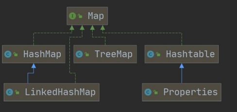
3. 集合子类特点及选择
    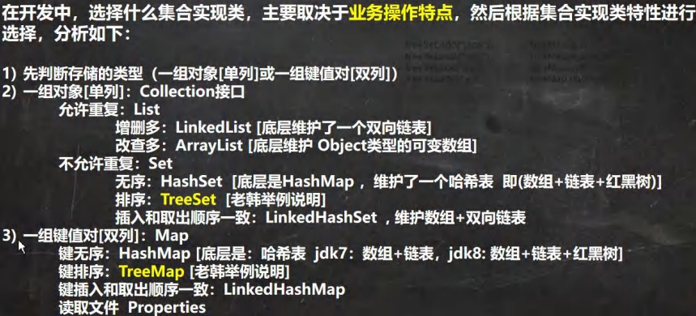


## List
1. List 集合类中元素有序(即添加顺序和取出顺序一致)、且可重复
2. List 集合中的每个元素都有其对应的顺序索引
3. list.size()是实际包含的元素数量

## ArrayList
1. ArrayList线程不安全
2. 由数组实现数据存储,保存在`transient Object[] elementData;`

## vector
1. vector线程安全
2. 数据保存在`protected Object[] elementData;`
   

## LinkedList
1. 双向列表，有first last Node
2. Node中有prev next element

## HashSet
1. 实现了Set接口，没有顺序，不能重复，底层由**HashMap**实现，HashMap<K, V>的value=默认的Obejct对象PRESENT
2. 由一个装了Node<K,V>[] table数组实现，每个节点有next指向下一个Node
3. table可以动态扩容，数组->链表->红黑树(如果链表的长度超过8，并且table的大小超过64，就会变成红黑树)
4. 常用方法：add
5. Set的遍历：
    * 迭代器
    * 增强for循环
    * 不能用常规for循环，因为没有顺序索引

## LinkedHashSet
1. 实现了Set接口，有顺序，不能重复，底层用LinkedHashMap实现，是HashSet的子类
2. 底层维护了一个数组+双向链表

## HashMap<K, V>
1. key值不重复，key - value一一对应
2. key value都可以是任何引用类型的数据
3. K, V存在Node<K,V>节点中，然后封装成Entry<K,V>，存在集合EntrySet中，即**EntrySet<Entry<K,V>>**， 便于遍历
4. 全部的key组成一个集合keySet，全部的value组成一个collections ：values
5. 常用方法：
    * put(K, V) get(K) clear() size() isEmpty() containsKey()
6. HashMap没有实现同步，线程不安全

## Hashtable
1. Hashtable的键和值都不能为null，extends Dictionary<K,V>
2. Hashtable线程安全
3. 底层是以一个Entry[] 数组

## TreeSet 
1. 可以自定义Comparator，因此有序，底层是**TreeMap**，TreeMap无序
2. 不能存放null
3. TreeSet 添加的对象必须实现Comparable 接口


# 泛型


# 坦克大战

## 绘图
1. 最外层是一个Jframe，里面是一个JPanel, JPanel里有各种画笔
2. JPanel可以实现事件监听器接口(如KeyListener), 实现事件监听，事件监听方法里面监听后需要重画this.repaint()
3. Jframe的构造器添加一个JPanel，添加事件监听器

# 线程

## 线程基础
1. 程序是代码，进程是一个程序的运行过程(动态)，线程由进程创建，轻量级进程
2. 并发和并行
    * 并发：同一时刻，多个任务交替执行
    * 并行：同一时刻，多个任务同时执行
3. 继承Thread类，重写run()方法，可以调用Thread的start()方法即可
4. 也可试下Runnable接口，重写run()方法，将实例化的对象放入Thread的构造器中，可以实现上述方法
5. 常用方法：
    * interrupt，中断线程，但并没有真正的结束线程。所以一般用于中断正在休眠的线程
    * thread.join(), 插队，执行完插队的再执行插队前的
    * thread.yield(),礼让，不一定礼让成功
6. 用户线程（工作线程）和守护线程
    * 用户线程：当线程的任务执行完或通知方式结束
    * 守护线程：一般是为工作线程服务的，当所有的用户线程结束，守护线程自动结束，常见的守护线程: 垃圾回收机制
    * `thread.setDaemon(true);`设置成守护进程

## 线程同步
1. 线程7个状态
    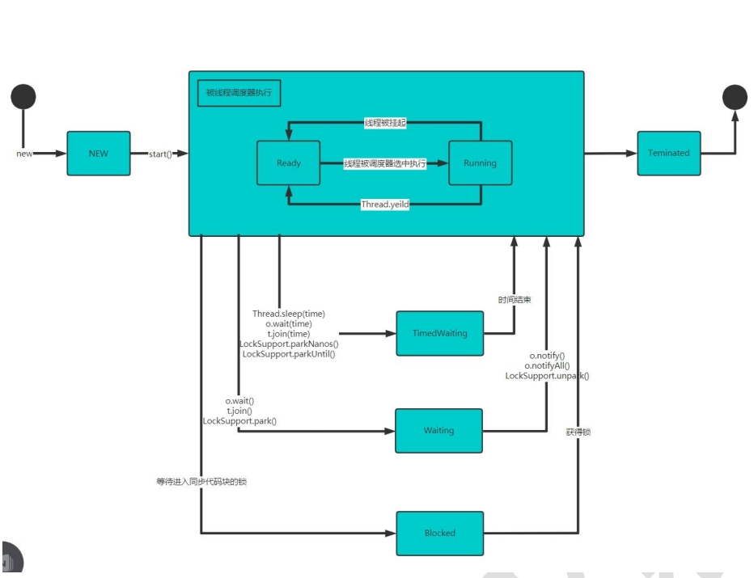
2. 每个对象有**互斥锁**标记，与关键字synchronized联系，表明该方法同一时刻，只允许一个线程访问资源(即同步)
3. 同步效率低
4. 同步方法(非静态的)的锁可以是this，也可以是其他对象，但必须是同一个对象
5. 同步方法(静态的)的锁为当前类本身
6. sleep yield不会释放锁


# 文件与I/O

## 常用操作
1. 创建File对象:
    * `File file = new File(filePath);`
    * `File file = new File(File: parentPath:, String: fileName);`
    * `File file = new File(String: parentPath, String: fileName);`
2. 流:四个抽象类InputStream OutputStream Reader Writer
    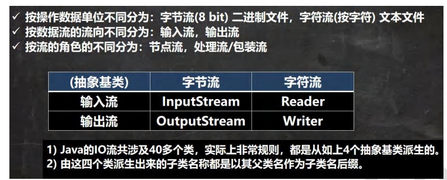
3. 字节流和字符流
    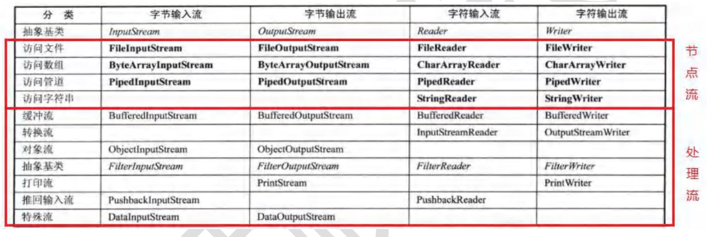

## 装饰器模式 
1. `BufferedInputStream(InputStream in)`使用了装饰器模式，包装了另一个InputStream对象，扩展其功能(提供缓冲的功能)

## 转换流
1. InputStreamReader(InputStream, charset:编码形式 例如"utf-8") 和 OutputStreamWriter(OutputStream, charset:"gbk")
2. 将字节流转换成字符流

## xxx.properties
1. `key=value`的形式保存
2. 常用方法：
    * load
    * store
    * list
    * setProperty(String: key, String: value)


## 序列化和反序列化
1. 序列化：保存数据的值和数据的类型
    `ObjectOutputStream oos = new ObjectOutputStream(new FileOutputStream(filePath));`
2. 反序列化：恢复数据的值和数据类型
    `ObjectInputStream ois = new ObjectInputStream(new FileInputStream(filePath));`
3. 序列化的对象**必须实现Serializable接口**，如Integer、String等包装类，class类需要`implements Serializable`


## 打印流-PrintStream 和 PrintWriter
1. 打印只有输出流，没有输入流
2. 在默认情况下，PrintStream 输出数据的位置是 标准输出，即显示器


# 网络
1. TCP：
    * `Socket socket = new Socket(InetAddress.getLocalHost(), 8888);`启动监听端口
    * serverSocket.accept(); 
2. UDP：
    * DatagramSocket
    * 将对象封装到DatagramPacket
    * sender:`DatagramPacket(data, data.length, InetAddress.getLocalHost(), 8888);`的此端口号要和Receiver号相同

# 项目开发流程
1. 需求分析
2. 设计阶段
3. 实现阶段
4. 测试阶段
5. 实施阶段
6. 维护阶段


# 反射

## 反射使用方法
1. `Class cls = Class.forName(classFullPath);`
2. `Object o = cls.newInstance();`
3. `Method method = cls.getMethod(methodName);`
4. `Constructor constructor = cls.getConstructor();`
5. 万物皆对象: `method.invoke(o);`
6. 优点:可以动态的创建和使用对象

## 反射相关的主要类
1. 四个类 Class Method Field Constructor
    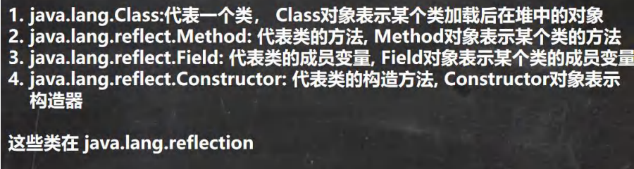
2. Class 类不是new 出来的,是系统加载出来的
3. 类加载
    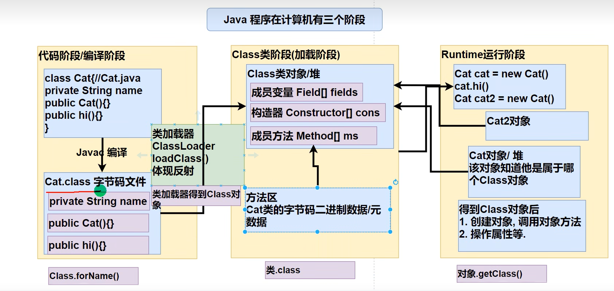
4. 加载方式:
    * 静态加载:编译时加载相关的类 -- new
    * 动态加载:运行时加载 -- 反射
5. 类加载过程:
    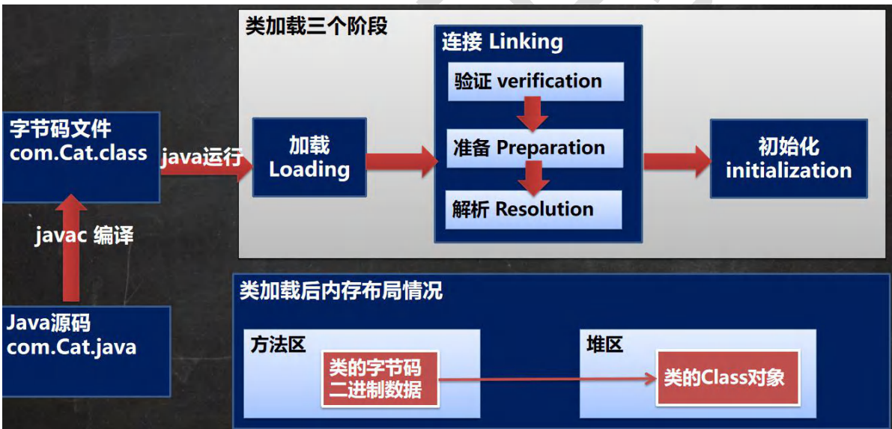
    * 验证: 安全验证
    * 准备: 静态变量**默认初始化**
    * 解析: 符号引用转为直接引用


# MySQL

## MySQL基本

1. mysql -h 主机IP -P 端口 -u 用户 -p密码
2. 三级模式:外模式 概念模式 内模式
    * 外模式:对应用户级数据库,又被称为用户视图,一个数据库可以有多个外模式。一个应用程序只能使用一个外模式。
    * 概念模式:对应概念级数据库,又称为DBA视图介于用户级和物理级之间,是所有用户视图的小并集,一个数据库应用系统只存在一个DBA视图
    * 内模式:对应物理级数据库,又被称为内部视图,物理级数据库**并不是**真正的物理存储，而是最接近于物理存储的一个抽象级
3. SQL语句分类:
    * DDL:数据定义语句 create
    * DML:数据操作语句 insert update delete
    * DQL:数据查询语句 select
    * DCL:数据控制语句 grant revoke
4. 常用数据类型
    * char(size) 固定长度**字符串**, 最大255字符, 每个字符占用size大小的空间
    * varchar 可变长度,0~65535**字节**,1~3字节记录大小,可以存放字符(65535-3)/3 = 21844  varchar(4)表示4个字符
5. ```
    SELECT deptno, AVG(sal) AS avg_sal
	FROM emp
	GROUP BY deptno
	HAVING  avg_sal > 1000
	ORDER BY avg_sal DESC
	LIMIT 0,2
    ```
## MySQL事务

6. 约束 not null; unique; primary key; foreign key; check;
    * primary key:一张表只有一个primary key, 可以由多个列组成的复合主键
    * unique: 可以有多个null, unique not null 使用效果类似主键
    * foreign key:表的外键是另一表的主键, 外键可以有重复的, 可以是空值 `FOREIGN KEY (从表键名) REFERENCES 主表名称(主表键名)`,外键类型要和主键类型一致(长度可以不同)
7. 事务:一组相关的DML语句(insert update delete)组成,要么全部成功,要么全部失败,保证一致性 
    * commit: 确认事务的变化 结束事务 删除保存点 释放锁 数据生效
8. 隔离级别:读未提交,读已提交,可重复读,可串行化
    * 脏读dirty read: 一个事务读取另一个事务尚未提交的更改时,产生脏读
    * 不可重复读nonrepeatable read:同一查询在同一事务中多次进行,由于其他提交事务所做的**修改或删除**, 每次返回不同的值
    * 幻读phantom read: 同一查询在同一事务中多次进行,由于其他提交事务所做的**插入**, 每次返回不同的值
    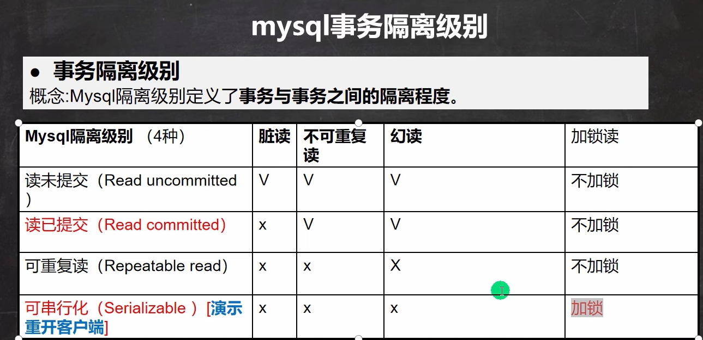
9. `SELECT @@tx_isolation;`查看当前会话隔离级别
    `SELECT @@global.tx_isolation;`查看当前系统隔离级别
    `SET SESSION TRANSACTION ISOLATION LEVEL 四个级别名称`设置当前会话隔离级别
    在my.ini中可以配置默认的隔离级别 `transaction-isolation = 级别`
10. 事务的acid特性:
    * 原子性atomicity: 事务是一个不可分割的工作单位
    * 一致性consistency:事务使数据库从一个一致性状态变换到另一个一致性状态
    * 隔离性isolation:多用户并发访问数据库时,数据库为每一个用户开启的事务，不能被其他事务的操作数据所干扰，多个并发事务之间要相互隔离。
    * 持久性:一个事务一旦被提交,对数据库中数据的改变是永久性的

## 存储引擎和视图
11. 存储引擎:
    * innodb: 支持事务,支持外键,支持行级锁
    * myisam: 1. 添加速度快 2. 不支持外键和事务 3. 支持表级锁
    * memory: 1. 数据存储在内存中(关闭了Mysql服务，数据丢失, 但是表结构还在) 2. 执行速度很快(没有IO读写) 3. 默认支持索引(hash表)
    * 索引: 
        - 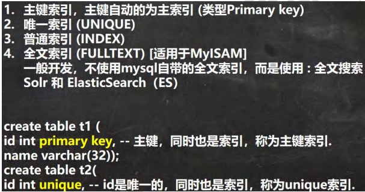
        - `create unique INDEX name_index on goods(goods_name);`
        - `drop index name_index on goods;`
12. 视图:
    * 视图是一个虚拟表，其内容由查询定义
    * 同真实的表一样，视图包含列,其数据来自对应的真实表(基表)
    * 视图的数据变化会影响到基表，基表的数据变化也会影响到视图
    * 基本使用: 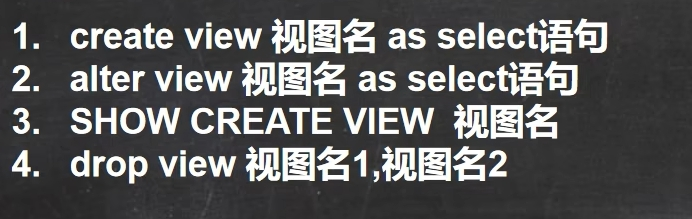

## MySQL管理
13. user表:
    * host:允许登录的“位置”，localhost表示该用户只允许本机登录，也可以指定ip地址，比如:192.168.1.1002
    * user:用户名
    * authentication string: 密码，是通过mysql的password()函数加密之后的密码

## jdbc
14. sql 注入问题,因输入拼接导致的对数据库的错误访问或者更改
15. 批处理机制:多次sql语句包装成ArrayList, 需要在properties文件中给关键字url添加`rewriteBatchedStatements=true`
16. 数据库连接池:缓冲池中有预先的连接,当需要使用时,直接使用缓冲池中的连接,使用完成后放回即可, 常用连接池:C3P0, Druid(德鲁伊)
17. statement.executeQuery() 返回的 ResultSet 在 Connection 关闭后就不存在了


# 正则表达式

1. 创建一个模式 Pattern 对象
2. 创建一个匹配器 Matcher 对象 pattern.matcher
3. matcher.find() 定位满足规则的 子字符串的位置并添加到 matcher.group() 中
4. 常用匹配
    * \\\d : 单个数字
    * \\\D : 单个非数字
    * \\\w : **等效[A-Za-z0-9_]**
    * \\\W : 单个字符
    * .   : 除\n以外任何字符
    * []  : 可接收列表
    * [^] : 不可接收列表
    * {n} : n个
    * {n,}: 至少n个
    * {n,m}:n-m个
    * \*  : 0或者更多
    * \+  : 1或更多
    * ?   : 0或者1
    * ^   : 起始
    * $   : 结束
    * \\\b: 目标边界
    * \\\B: 目标非边界
    * (?i): 不区分大小写
    * ()  : 非命名分组
    * (?\<group_name>pattern): 命名分组
    * 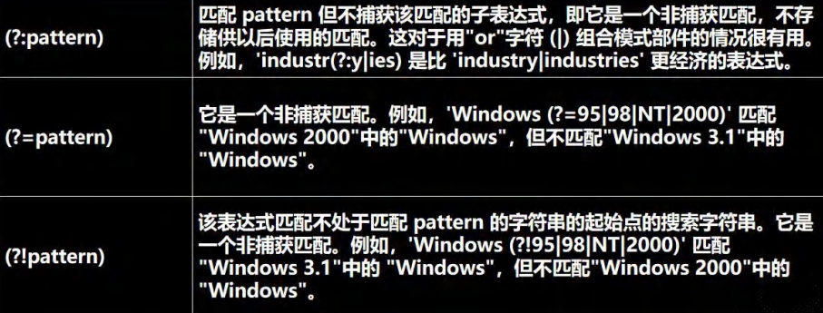
    * [\u0391-\uFFE5] 是匹配**中文**的正则
5. 反向引用:
    * ()中的内容被捕获后，可以在这个括号后被使用，从而写出一个比较实用的匹配模式，这个我们称为反向引用，这种引用既可以是在正则表达式内部，也可以是在正则表达式外部，**内部反向引用 \\\ 分组号，外部反向引用$分组号**
    * 个位与千位相同,十位和百位相同 5225 1661 `(\\d)(\\d)\\2\\1`
    * 连续5个相同的模式 `(pattern)\\1{4}`

    


